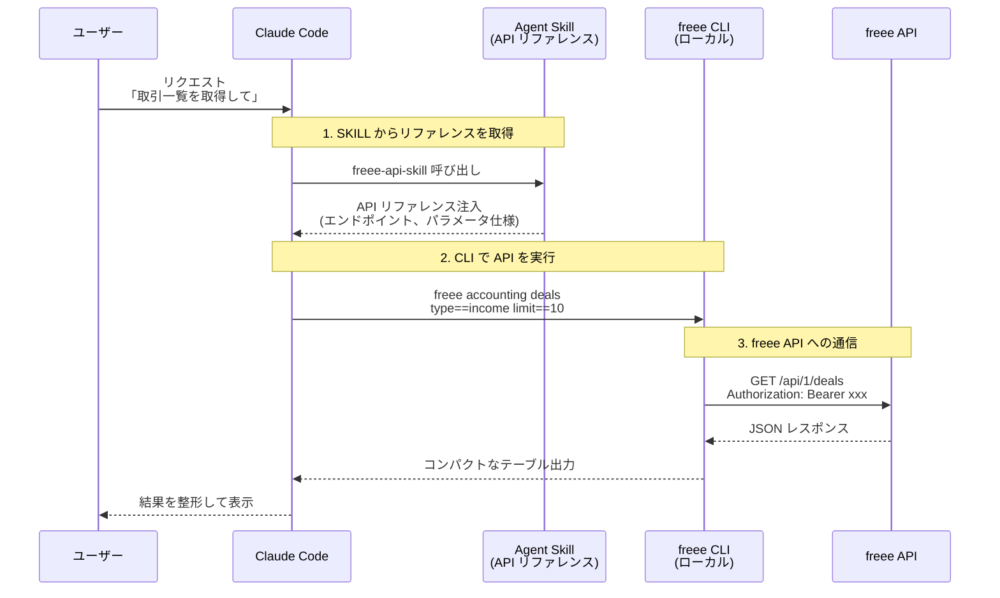

# freee-mcp

freee API を AI エージェントから操作するための CLI & Agent Skill です。

CLI と skill（API リファレンス）を組み合わせて利用することを想定しています。

[](https://www.npmjs.com/package/freee-mcp)

> Note: このプロジェクトは開発中であり、予期せぬ不具合が発生する可能性があります。問題を発見された場合は [Issue](https://github.com/freee/freee-mcp/issues) として報告していただけると幸いです。

## 特徴

- freee CLI: シェルから直接 freee API を操作（トークン効率の高いコンパクト出力）
- Agent Skill: 詳細な API リファレンスドキュメント付きスキルを提供
- 複数 API 対応: 会計・人事労務・請求書・工数管理・販売の5つの freee API をサポート
- OAuth 2.0 + PKCE: セキュアな認証フロー、トークン自動更新
- 複数事業所対応: 事業所の動的切り替えが可能

## SKILL と CLI の連携の流れ

Claude Code では、SKILL（API リファレンス）と CLI（API 呼び出し）を組み合わせて利用します。



この仕組みにより：
- SKILL: 必要な API リファレンスを段階的にコンテキストに注入（コンテキスト効率化）
- CLI: 認証・リクエスト検証・API 呼び出しを担当（コンパクト出力でトークン効率化）

## クイックスタート

### 1. freee アプリケーションの登録

[freee アプリストア](https://app.secure.freee.co.jp/developers) で新しいアプリを作成:

- コールバックURL: `http://127.0.0.1:54321/callback`
- Client ID と Client Secret を取得
- 必要な権限にチェック

### 2. セットアップ

```bash
npx freee-mcp configure
```

対話式ウィザードが認証情報の設定、OAuth認証、事業所選択を行います。

### 3. CLI を使う

```bash
freee auth status         # 認証状態を確認
freee accounting ls       # エンドポイント一覧
freee accounting deals    # 取引一覧を取得
freee --help              # ヘルプ
```

## Claude Code Plugin として使う

Claude Code でプラグインとしてインストールすると、Agent Skill（API リファレンス付きスキル）がまとめて利用できます。

```bash
claude plugin install freee/freee-mcp
```

## Skill のみインストールする

Claude Code 以外のコーディングエージェント（Cursor, OpenCode など）で API リファレンス付きスキルを利用する場合は、[skills](https://www.npmjs.com/package/skills) でインストールできます。

```bash
npx skills add freee/freee-mcp
```

グローバルインストール(`-g`)や特定スキルのみのインストール(`-s`)も可能です。

### 含まれるリファレンス

| API      | 内容                                             | ファイル数 |
| -------- | ------------------------------------------------ | ---------- |
| 会計     | 取引、勘定科目、取引先、請求書、経費申請など     | 31         |
| 人事労務 | 従業員、勤怠、給与明細、年末調整など             | 28         |
| 請求書   | 請求書、見積書、納品書                           | 3          |
| 工数管理 | プロジェクト、チーム、パートナー、工数、ユーザーなど | 7          |
| 販売     | 案件、受注、マスタ                               | 3          |

Claude との会話中に API の使い方を質問すると、これらのリファレンスを参照して正確な情報を提供します。

### データ作成のベストプラクティス

請求書や経費精算など、同じ形式のデータを繰り返し作成する場合は、以前に作成したデータを参照することで効率的に作業できます：

- 請求書作成: 過去の請求書を取得して、取引先・品目・税区分などを参考にする
- 経費精算: 過去の申請を参照して、勘定科目や部門の指定を正確に行う
- 取引登録: 類似の取引を参考にして、入力ミスを防ぐ

```
例: 「先月の○○社への請求書を参考に、今月分を作成して」
```

## freee CLI コマンド

### 認証・事業所

| コマンド | 説明 |
|---------|------|
| `freee auth login` | OAuth 認証 |
| `freee auth status` | 認証状態を確認 |
| `freee auth logout` | ログアウト |
| `freee company ls` | 事業所一覧 |
| `freee company set <id>` | 操作対象の事業所を設定 |
| `freee company current` | 現在の事業所を表示 |

### API 操作

| コマンド | 説明 |
|---------|------|
| `freee <service> ls [filter]` | エンドポイント一覧 |
| `freee <service> <path> --docs` | API ドキュメント |
| `freee <service> <path> --help` | メソッド一覧 |
| `freee <service> <path> key==val` | クエリ付き GET |
| `freee <service> <path> key=val` | POST リクエスト |
| `freee <service> <path> -X METHOD` | HTTP メソッド指定 |

service: accounting, hr, invoice, pm, sm

### company_id の取り扱い

リクエスト（パラメータまたはボディ）に `company_id` を含める場合、現在の事業所と一致している必要があります。不一致の場合はエラーになります。

- 事業所の確認: `freee company current`
- 事業所の切り替え: `freee company set <id>`
- company_id を含まない API（例: `/api/1/companies`）はそのまま実行可能

## コントリビューション

詳しくは [CONTRIBUTING.md](./CONTRIBUTING.md) をご覧ください。

### Contributors

<!-- CONTRIBUTORS-START -->
<a href="https://github.com/him0"></a>
<a href="https://github.com/dais0n"></a>
<a href="https://github.com/HikaruEgashira"></a>
<a href="https://github.com/nakanoasaservice"></a>
<a href="https://github.com/tackeyy"></a>
<a href="https://github.com/worldscandy"></a>
<a href="https://github.com/akhr77"></a>
<a href="https://github.com/trpfrog"></a>
<a href="https://github.com/hoshinotsuyoshi"></a>
<a href="https://github.com/JeongJaeSoon"></a>
<a href="https://github.com/norimura114"></a>
<a href="https://github.com/akiras-ssrd"></a>
<a href="https://github.com/inoue2002"></a>
<a href="https://github.com/jacknocode"></a>
<a href="https://github.com/tnj"></a>
<a href="https://github.com/jaxx2104"></a>
<a href="https://github.com/kbyk004"></a>
<!-- CONTRIBUTORS-END -->

## 開発者向け

```bash
git clone https://github.com/freee/freee-mcp.git
cd freee-mcp
bun install

bun run dev           # 開発サーバー（ウォッチモード）
bun run build         # ビルド
bun run typecheck    # 型チェック
bun run lint          # リント
bun run test:run      # テスト

# API リファレンスの再生成
bun run generate:references
```

### 技術スタック

TypeScript / OAuth 2.0 + PKCE / Zod / Bun

### アーキテクチャ詳細

プロジェクトのアーキテクチャ、内部構造、開発ガイドラインについては [CLAUDE.md](./CLAUDE.md) を参照してください。

## License / ライセンス

[Apache-2.0](./LICENSE)

## コミュニティ

質問や情報交換は Discord サーバーで行っています。お気軽にご参加ください。

- [Discord サーバー](https://discord.gg/9ddTPGyxPw)

## 関連リンク

- [紹介記事: Public API を MCP化するとき Agent Skill 併用が良さそう with freee-mcp](https://zenn.dev/him0/articles/766798ca1315e0)
- [freee API ドキュメント](https://developer.freee.co.jp/docs)
- [Model Context Protocol](https://modelcontextprotocol.io)
